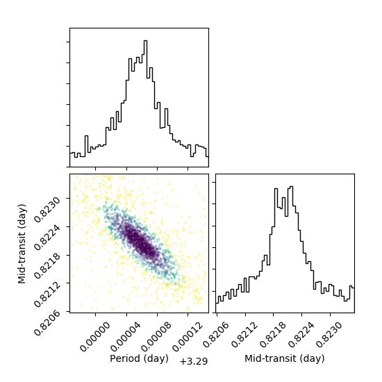
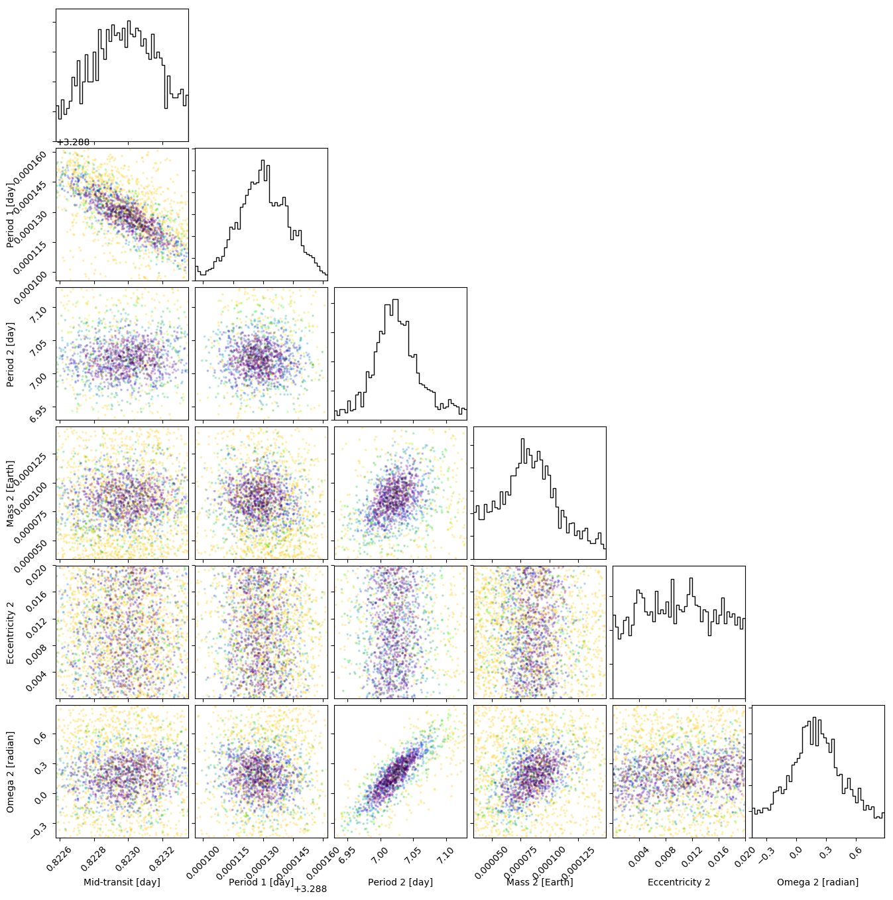

color-corner.py
=========
Same library as the original except the data points are plotted with ax.scatter instead of ax.plot allowing for custom color maps in "data_kwargs"

Read the [original documentation](http://corner.readthedocs.io/)

## Installation:
```
git clone https://github.com/pearsonkyle/color-corner.py.git
cd color-corner/
python setup.py build
python setup.py install
```

Examples: 
```python
    f = corner.corner(nlposteriors[mask,2:], 
        labels= labels,
        bins=int(np.sqrt(nlposteriors.shape[0])), 
        range= ranges,
        #quantiles=(0.16, 0.84),
        plot_contours=False,
        plot_density=False,
        data_kwargs={
            'c':nlposteriors[mask,1],
            'vmin':np.percentile(nlposteriors[:,1],1),
            'vmax':np.percentile(nlposteriors[:,1],50),
            'cmap':'jet',
        },
        label_kwargs={
            'labelpad':15,
        },
        hist_kwargs={
            'color':'black'
        }
    )
```





Used to create posteriors for: https://github.com/pearsonkyle/Nbody-AI/
